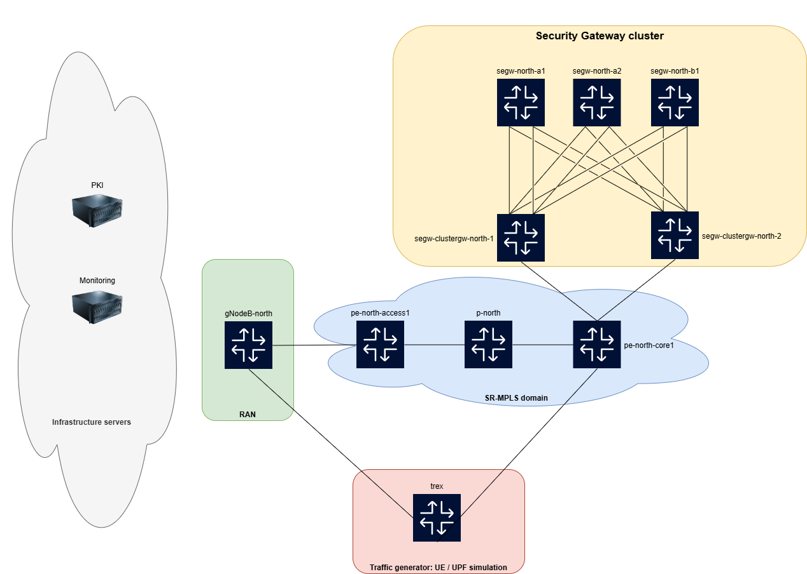

# 6WIND's Security Gateway containerlab demo

## Host requirements

To replay this lab, the following environments have been validated:

* Host/VM running Ubuntu 24.04 server, with 24 vCPUs, 12GB RAM, 20GB disk
* AWS: c5a.8xlarge instance with 20GB disk, running Ubuntu 24.04 AMI. **Note: the kernel must be switched to the generic flavor to use this lab.**

Software requirements:

* 6WIND VSR image >= 3.10
* containerlab >= 0.68


## Introduction

This lab aims at simulating a simplified mobile network environment.



The main element under test is the Security Gateway cluster, composed of:

* Two **cluster gateways nodes**, ensuring redundancy of the cluster and load-balancing of traffic between the different members
* Three **security gateway nodes**, used in a 2+1 redundancy scheme, with two active gateways, and a single backup

All three **security gateway nodes** are dual attached to the **cluster gateway nodes**.
Each attachment is composed of link aggregation of two interfaces.


In addition to the Security Gateway cluster, the lab simulates multiple other nodes:

1. **gNodeB**

This node will be used to initiate IPsec tunnels towards the Security Gateway cluster.
It makes use of the strongswan loadtester plugin to initiate a high number of IPsec tunnels in an easy way.

2. **Backbone nodes: pe-access, p, pe-core**

These nodes runs L3VPN over SR-MPLS in order to transport the traffic between the gNodeB and the **security gateway nodes**.

3. **PKI**

This node is used as a Public Key Infrastructure server, delivering the needed certificates to both gNodeB and **security gateway nodes** for the IKE negociation.

4. **Monitoring**

This node leverages the InfluxDB/Grafana stack to receive the streamed telemetry data from the **security gateway nodes**


## Step by step lab setup

1. <ins>Clone the demo repository</ins> 

The first step consists in cloning the demo repository. **git** must be installed:

```
sudo apt-get update
sudo apt-get install git
git clone https://github.com/6WIND/vsr-labs.git
cd vsr-labs/demo-mobile-segw
```

2. <ins>Generic kernel installation (not needed if already installed)</ins>

If you are using a cloud-based ubuntu flavor, such as AWS, it may comes with a specific kernel which lacks some features needed for this lab.
To install the generic Ubuntu kernel, execute the provided script. 

```
./generic-kernel-setup.sh
```

At the end of the installation process, the script will automatically load the freshly installed kernel.
You will need to log back in on the server, and get back in the demo directory.

3. <ins>Host node configuration</ins>

Run the host-config.sh script in order to prepare the host to run the lab. The script is written for a vanilla ubuntu 24.04 distribution.
It will configure some sysctls, load the appropriate kernel modules needed by 6WIND's VSR, and install containerlab.

```
./host-config.sh
```

** After running the script, you must log out and log back in, in order to refresh the groups your user belongs to**

4. <ins>Register to 6WIND's registry</ins> 

Log in the 6WIND's docker registry with the provided credentials:

```
docker login -u <username> -p <password> download.6wind.com
```

Note: you can register on [6WIND's evaluation portal](https://portal.6wind.com/register.php) to request credentials to access the registry, and a license.


5. <ins>License provisioning</ins>

Edit the license file and copy paste the serial obtained from the evaluation portal.

```
cd vsr-labs/demo-mobile-segw
echo "6WIND-EVALS-XXXXXXXX-XXXXXXXXXXXXXXXXXXXXXXXXXXXX" > license
```

6WIND's VSR uses a token-based mechanism for licensing. The host must have internet access in order to play this lab.

6. <ins>Lab deployment</ins> 

Run the lab by calling the deployment script:

```
./deploy.sh
```

The script should deploy the topology with all the containers involved in the scenario.
It will take a couple of minutes to install the PKI, and the traffic generator software.
When done, you will see a summary of the deployed containers.
To jump in the screen and access each of the nodes, press <kbd>Enter</kbd>.


## Lab usage

### Screen usage

After launching the lab, you will be in a **screen** (`man screen` for more details), allowing you to quickly access the devices using a tab-based navigation.
To jump from one tab to another, use <kbd>ctrl</kbd><kbd>p</kbd> followed by the number of the tab you want to access (e.g. <kbd>0</kbd> for gNodeB, <kbd>1</kbd> for pe-access, etc.).
To jump to a tab with an ID higher than 9, you can use <kbd>ctrl</kbd><kbd>p</kbd> + <kbd>"</kbd> to visually display the list of tabs.
To exit the screen, use <kbd>ctrl</kbd><kbd>p</kbd> + <kbd>d</kbd>. You can reconnect to a detached screen with the `screen -x` command.

### Lab initialization steps

1. <ins>Introduction</ins>

All the nodes are preprovisioned with their init config, except for the **security gateway nodes**.
One of the objective of the lab is to demonstrate the automation capabilities of the 6WIND's VSR product.
We will use ansible to provision the router in our example.

2. <ins>Certificate provisioning</ins>

The PKI container is configured to import a Root CA, and create End Entity profiles for each of our three **security gateway nodes**.
An ansible playbook is used to automate the CMPv2 request enrollment process initiated by these nodes.
From the host screen tab (ID 10), run the following command:

```
ansible-playbook -i ansible/inventory -i  clab-6wind-mobile-segw/ansible-inventory.yml ansible/playbooks/certificate-provisioning.yaml
```

The playbook should successfully exit.
In order to check that the certificates have been generated for each of the node, you can access the EJBCA web interface using the following URL: 

https://*host_IP_address*:8443/ejbca/adminweb/ra/searchendentities.xhtml

Clicking on the SEARCH button associated with "Search end entities with status" "All" will display all the End Entities declared with their respective status.

3. <ins>Security gateway nodes configuration</ins>

Now, let's process with the initial configuration for the security gateway cluster. In this initial configuration, **segw-north-a1** will be the single active node in the cluster, backed up by **segw-north-b1**. The **segw-north-a2** node is unused at this stage.

To start the configuration provisioning for the different nodes, let's run the following command from the screen's host tab (ID 10). 

```
ansible-playbook -i ansible/inventory -i  clab-6wind-mobile-segw/ansible-inventory.yml ansible/playbooks/init.yaml
```

The expected recap output is provided below:

```
PLAY RECAP *************************************************************************************************************************************************************************************************
clab-6wind-mobile-segw-segw-north-a1 : ok=5    changed=4    unreachable=0    failed=0    skipped=0    rescued=0    ignored=0
clab-6wind-mobile-segw-segw-north-a2 : ok=6    changed=4    unreachable=0    failed=0    skipped=0    rescued=0    ignored=0
clab-6wind-mobile-segw-segw-north-b1 : ok=5    changed=4    unreachable=0    failed=0    skipped=0    rescued=0    ignored=0
```

Once the playbook has been run, the gNodeB must be able to ping the security gateway cluster IPsec endpoint IP address:

```
root@gNodeB-north:~# ip netns exec untrusted ping 55.55.55.1 -I 110.1.0.0 -c 2
PING 55.55.55.1 (55.55.55.1) from 110.1.0.0 : 56(84) bytes of data.
64 bytes from 55.55.55.1: icmp_seq=1 ttl=61 time=0.404 ms
64 bytes from 55.55.55.1: icmp_seq=2 ttl=61 time=0.217 ms

--- 55.55.55.1 ping statistics ---
2 packets transmitted, 2 received, 0% packet loss, time 1050ms
rtt min/avg/max/mdev = 0.217/0.310/0.404/0.093 ms
```

This IP address is advertised by the cluster to the backbone using BGP & BFD combination for fast fail-over detection. \
The ping initiated from the gNodeB will be transported over the MPLS backbone to the cluster, and be delivered to the active security gateway node.

4. <ins>IPsec tunnels initiation from the gNodeB</ins>

Now that the connectivity is established between the gNodeB and the security gateway cluster, we can launch the script that will initiate IPsec tunnels.\
From the screen gNodeB tab (ID: 0), execute the script below to start the IPsec tunnel establishment.

```
root@gNodeB-north:~# cd scripts/
root@gNodeB-north:~/scripts# ./start_loadtester.sh 2000
Start tunnel negociation: Tue Apr 15 13:02:01 UTC 2025
Starting load-tester in netns untrusted
Starting strongSwan 5.9.14 IPsec [starter]...
End of tunnel negociation: Tue Apr 15 13:02:23 UTC 2025: number tunnels established: 2000
Cleaning VIPs
2000 IP addresses deleted
Ready
```

From the active security gateway node (screen ID 6), check that IPsec tunnel are established. They are spread among two running logical instances.\
 The reason will be explained during the scale-out testing.

```
segw-north-a1> show ike ike-sa-count vrf untrusted_1
982
segw-north-a1> show ike ike-sa-count vrf untrusted_2
1018
```

Note that the backup security gateway (screen ID 8) has also the tunnels configured, thanks to the stateful synchronization of the information between the two members:

```
segw-north-b1> show ike ike-sa-count vrf untrusted_1
982
segw-north-b1> show ike ike-sa-count vrf untrusted_2
1018
```

5. <ins>Push some traffic</ins>

In order to proceed with the traffic start, jump on the trex tab (screen ID 9), and run the following command.

```
trex>start -f /root/traffic.py
Removing all streams from port(s) [0._, 1._]:                [SUCCESS]
Attaching 15 streams to port(s) [0._]:                       [SUCCESS]
Attaching 14 streams to port(s) [1._]:                       [SUCCESS]
Starting traffic on port(s) [0._, 1._]:                      [SUCCESS]
61.68 [ms]
```

Then, call the `tui` command to enter the TREX UI to visualize the traffic statistics.

On the nodes between the gNodeB and the security gateway nodes, the traffic can be inspected to check it is ciphered as expected.
Example taken on the **pe-north-access1** node:

```
pe-north-access1> cmd traffic-capture vrf backbone p count 2
tcpdump: verbose output suppressed, use -v[v]... for full protocol decode
listening on p, link-type EN10MB (Ethernet), snapshot length 262144 bytes
15:33:52.030137 aa:c1:ab:c0:03:3a > aa:c1:ab:ac:9b:5f, ethertype MPLS unicast (0x8847), length 830: MPLS (label 16013, exp 0, ttl 63) (label 16, exp 0, [S], ttl 63) 110.1.140.61 > 55.55.55.1: ESP(spi=0xceb43d7d,seq=0xe43), length 788
15:33:52.030142 aa:c1:ab:c0:03:3a > aa:c1:ab:ac:9b:5f, ethertype MPLS unicast (0x8847), length 830: MPLS (label 16013, exp 0, ttl 63) (label 16, exp 0, [S], ttl 63) 110.1.179.147 > 55.55.55.1: ESP(spi=0xcf79d102,seq=0xe43), length 788
2 packets captured
```

6. <ins>Traffic monitoring</ins>

Monitor the traffic using the InfluxDB/Grafana stack

Use a Web browser and log on: http://*host_public_IP_address*:3000/ with admin:admin credentials.
In the left menu, select "Dashboard", and then "router".
Scrolling down to the interface statistics, you should be able to see the traffic flowing through the active security gateway node.
You can set an auto-refresh rate on the top right of the UI.

7. <ins>Trigger a scale-out</ins>

In this demo, the scale-out is manually triggered by running an ansible playbook.
The goal will be to load-balance the actual traffic processed by the single segw-north-a1 node, so that half of it is processed by a second active node (segw-north-a2).
Still, the backup node will backup each of the node once the scale-out operation is completed.
This scale-out operation is done seamlessy, without traffic as little as possible.
From the host (screen ID 10), run the scale-out playbook in this way:

```
ansible-playbook -i ansible/inventory -i  clab-6wind-mobile-segw/ansible-inventory.yml ansible/playbooks/scale-out.yaml
```

After the playbook execution is successfully completed:

```
PLAY RECAP *************************************************************************************************************************************************************************************************
clab-6wind-mobile-segw-segw-north-a1 : ok=13   changed=6    unreachable=0    failed=0    skipped=0    rescued=0    ignored=0
clab-6wind-mobile-segw-segw-north-a2 : ok=12   changed=6    unreachable=0    failed=0    skipped=0    rescued=0    ignored=0
clab-6wind-mobile-segw-segw-north-b1 : ok=12   changed=6    unreachable=0    failed=0    skipped=0    rescued=0    ignored=0
```

You should be able to visually check in the Grafana dashboard that the traffic load is distributed among segw-north-a1 and segw-north-a2.
You can select the visualized host in the grafana dashboard using the scroll-down menu on the top left part on the dashboard.


8. <ins>Simulate a failure</ins>

You can simulate a failure to validate that the backup node is able to seamlessly process the traffic when an active instance is failing.
From the host tab, pause the segw-north-a1 container.

```
ubuntu@clab:~/demo-mobile-segw$ docker pause clab-6wind-mobile-segw-segw-north-a1
clab-6wind-mobile-segw-segw-north-a1
```

In Grafana, you will see that the traffic is now processed by the segw-north-b1 node.

9. <ins>Recover from a failure</ins>

From the host tab, unpause the segw-north-a1 container.

```
ubuntu@clab:~/demo-mobile-segw$ docker unpause clab-6wind-mobile-segw-segw-north-a1
clab-6wind-mobile-segw-segw-north-a1
```

Once the node is unpaused, it will get back its connectivity. It will for for the IPsec tunnel resynchronization, before preempting the backup node.
The traffic will flow back through both segw-north-a1 and segw-north-a2.

10. <ins>Trigger a scale-in</ins>

This is the reverse operation of scaling-out. We will free segw-north-a2, an example would be low traffic that can be processed by a single node.
From the host tab, trigger the scale-in:


```
ubuntu@clab:~/demo-mobile-segw$ ansible-playbook -i ansible/inventory -i  clab-6wind-mobile-segw/ansible-inventory.yml ansible/playbooks/scale-in.yaml
```

The playbook will run until completion:

```
PLAY RECAP *************************************************************************************************************************************************************************************************
clab-6wind-mobile-segw-segw-north-a1 : ok=12   changed=6    unreachable=0    failed=0    skipped=0    rescued=0    ignored=0
clab-6wind-mobile-segw-segw-north-a2 : ok=13   changed=6    unreachable=0    failed=0    skipped=0    rescued=0    ignored=0
clab-6wind-mobile-segw-segw-north-b1 : ok=12   changed=6    unreachable=0    failed=0    skipped=0    rescued=0    ignored=0
```

The traffic will finally flow back through segw-north-a1 only.

## Shutdown the lab


From the host tab (screen ID 10), run the destroy command below.

```
./destroy.sh --cleanup 
```

The `cleanup` option will avoid saving the current container configuration.
If you do some modification to the configuration and want to reinstantiate the lab from its latest configuration, do not use this flag.
